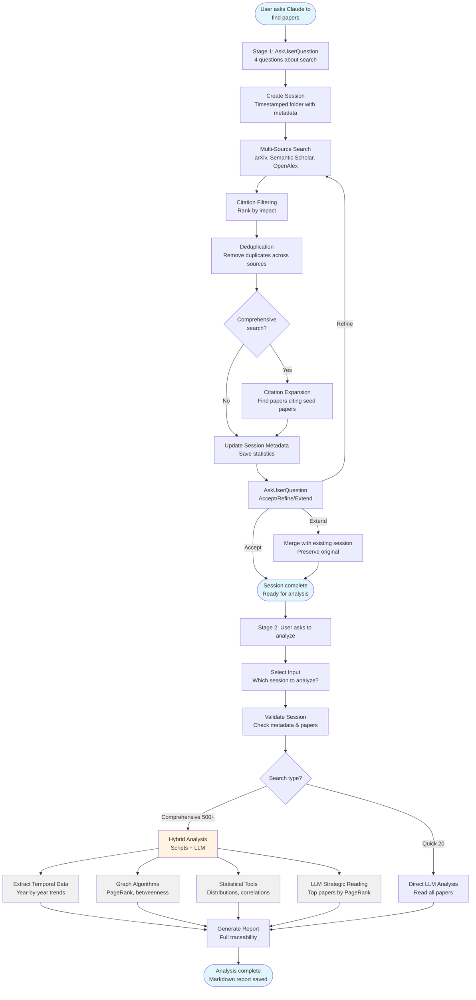

# Research Companion for Claude Code

**A Claude Code plugin for systematic academic paper discovery and analysis**

[](https://github.com/modaribrahim/research-companion/releases)
[](https://conventionalcommits.org)
[](https://opensource.org/licenses/MIT)
[](https://docs.claude.com/claude-code)
[](https://github.com/modaribrahim/research-companion/issues)

---

Simply ask Claude to find and analyze academic papers, and Research Companion searches across arXiv, Semantic Scholar, and OpenAlex to discover relevant literature, performs citation network analysis, identifies influential papers, and generates traceable reports—transforming hours of manual research into minutes with full citation tracking and reproducible analysis.

<div align="center">

  

  ```
  ▛▀▖                  ▌   ▞▀▖                ▗
  ▙▄▘▞▀▖▞▀▘▞▀▖▝▀▖▙▀▖▞▀▖▛▀▖ ▌  ▞▀▖▛▚▀▖▛▀▖▝▀▖▛▀▖▄ ▞▀▖▛▀▖
  ▌▚ ▛▀ ▝▀▖▛▀ ▞▀▌▌  ▌ ▖▌ ▌ ▌ ▖▌ ▌▌▐ ▌▙▄▘▞▀▌▌ ▌▐ ▌ ▌▌ ▌
  ▘ ▘▝▀▘▀▀ ▝▀▘▝▀▘▘  ▝▀ ▘ ▘ ▝▀ ▝▀ ▘▝ ▘▌  ▝▀▘▘ ▘▀▘▝▀ ▘ ▘
  ```

  **Search** • **Analyze** • **Cite** — Your Research Companion

</div>

---

[](https://www.python.org/downloads/)
[](https://claude.ai/)
[](https://click.palletsprojects.com/)
[](https://requests.readthedocs.io/)
[](https://arxiv.org/)
[](https://www.semanticscholar.org/)
[](https://openalex.org/)

**Built With**:
• Python 3.10+ • Claude Code • Click • Requests • arXiv API • Semantic Scholar API • OpenAlex API

---

## Quick Start

Start a new Claude Code session in your terminal and run:

```bash
% claude
> /plugin marketplace add modaribrahim/research-companion
  ⎿  Successfully added marketplace: research-companion-marketplace

> /plugin install research-companion@research-companion-marketplace
  ⎿  ✓ Installed research-companion. Restart Claude Code to load new plugins.
```

Restart Claude Code. Then simply ask:

```
"Find papers on quantum machine learning"
"Analyze the papers from that session"
```

Claude will automatically search for papers and generate comprehensive analysis reports.

**Key Features:**
- 📚 **Multi-Source Search** - Search arXiv, Semantic Scholar, and OpenAlex simultaneously
- 🔍 **Session Management** - Each search creates a unique session—no data loss
- 📊 **Two Search Modes** - Quick (20 papers) or Comprehensive (500+ papers)
- 🌐 **Citation Network Analysis** - PageRank, betweenness centrality, community detection
- 📈 **Statistical Analysis** - Distributions, frequencies, correlations
- 🎯 **Full Traceability** - Every claim cites specific papers
- 🔄 **Extensible** - Refine and extend searches without losing previous results

---

## How It Works

Research Companion follows a two-stage workflow to discover and analyze academic papers:



**Key Features:**

- **Session Isolation**: Each search creates a unique folder with timestamp—no data loss
- **Conditional Analysis**: Different strategies for quick (20 papers) vs comprehensive (500+)
- **Graceful Degradation**: Continues with available data if sources fail
- **Strategic Reading**: For comprehensive analysis, LLM reads top influential papers (PageRank) rather than all papers
- **Full Traceability**: Every claim in reports cites specific papers with numbered references

---

## Installation

### Prerequisites

- [Claude Code](https://docs.claude.com/claude-code) installed
- [uv](https://docs.astral.sh/uv/) (optional, for faster dependency installation)

### Install Plugin

Add this plugin to Claude Code:

```bash
% claude
> /plugin marketplace add modaribrahim/research-companion
  ⎿  Successfully added marketplace: research-companion-marketplace

> /plugin install research-companion@research-companion-marketplace
  ⎿  ✓ Installed research-companion. Restart Claude Code to load new plugins.
```

The plugin installs Python dependencies automatically if `uv` is available. If not, see [Manual Installation](#manual-installation) below.

### Manual Installation

If you don't have `uv`, install dependencies manually:

```bash
# Clone the repository
git clone https://github.com/modaribrahim/research-companion.git
cd research-companion

# Create virtual environment
python -m venv .venv
source .venv/bin/activate  # On Windows: .venv\Scripts\activate

# Install dependencies
pip install -r requirements.txt
```

### Verify Installation

In any Claude Code session:

```bash
"What skills are available?"
```

You should see `searching-ml-papers` and `analyzing-papers` listed.

---

## Usage

### Stage 1: Search for Papers

Simply ask Claude to find papers:

```bash
"Find papers on change detection in remote sensing using deep learning"
"Do a comprehensive search on quantum machine learning"
"Quick search for recent papers on large language models"
```

Claude will ask you 4 questions via AskUserQuestion:
1. **Search Type**: Quick (20 papers) or Comprehensive (500+)
2. **Time Range**: Recent, last 5 years, last 10 years, or all time
3. **Venues**: arXiv only, include conferences, or all sources
4. **Citation Filter**: All papers, 10+, 50+, or 100+

Then it will:
1. Create a unique session folder with timestamp
2. Search across arXiv, Semantic Scholar, and OpenAlex
3. Filter by citations
4. Remove duplicates
5. Present results with statistics
6. Ask: Accept, Refine, Extend, or View Details

**Session folders** are created in `searching-papers-v2/artifacts/session_YYYYMMDD_HHMMSS_topic/`

### Stage 2: Analyze Papers

After searching, analyze your collection:

```bash
"Analyze the papers from session_20250128_143026"
"Analyze that session"
"Generate a comprehensive analysis"
```

Claude will:
1. Validate the session
2. Create analysis experiment folder
3. Run appropriate analysis:
   - **Quick (20 papers)**: LLM reads all → direct analysis
   - **Comprehensive (500+)**: Graph algorithms + statistics + LLM strategic reading
4. Generate traceable report

**Experiment folders** are created in `analyzing-papers/artifacts/experiment_YYYYMMDD_HHMMSS_topic/`

### Example Workflow

```bash
# 1. User asks Claude to search
User: "Do a comprehensive search on change detection"

# 2. Claude asks questions, searches, creates session
Session: searching-papers-v2/artifacts/session_20250128_143026_change_detection/
Papers: 523 papers (2020-2025)

# 3. User asks to analyze
User: "Analyze that session"

# 4. Claude analyzes and creates experiment
Experiment: analyzing-papers/artifacts/experiment_20250128_150000_change_detection/
Report: analysis.md with full traceability
```

### Generated Output

**Search Sessions** contain:
- `metadata.json` - Search parameters and results
- `deduplicated.json` - Final paper collection
- `summary.json` - Statistics and top papers

**Analysis Reports** are created as Markdown files in `analyzing-papers/artifacts/experiment_*/analysis.md` with:
- Executive summary with citations
- Research landscape (methods, datasets)
- Citation network insights (influential papers via PageRank)
- Temporal trends (evolution over time)
- Statistical analysis (distributions, correlations)
- Research gaps and recommendations
- Appendix A: All papers (for verification)

---

## Features

### Multi-Source Paper Search

Search across three academic databases simultaneously:

- **[arXiv](https://arxiv.org/)**: Preprints and cutting-edge research
- **[Semantic Scholar](https://www.semanticscholar.org/)**: AI-powered paper search with citations
- **[OpenAlex](https://openalex.org/)**: Open database of global research

Each source provides different coverage and citation data, ensuring comprehensive discovery.

### Two Search Modes

**Quick Search** (20 papers max):
- Best for: Quick overview, specific papers, time-constrained research
- Takes: 5-10 seconds
- Citation-filtered by default
- No citation expansion

**Comprehensive Search** (500+ papers):
- Best for: Literature reviews, surveys, deep analysis
- Takes: 30-60 seconds
- Citation expansion enabled
- Full metadata tracking

### Session Management

Every search creates a unique session folder:

```
searching-papers-v2/artifacts/session_20250128_143026_change_detection/
├── metadata.json          # User preferences + search parameters
├── search_results.json    # Raw results from sources
├── filtered.json          # After citation filtering
├── deduplicated.json      # Final paper collection
└── summary.json           # Statistics + top papers
```

**Benefits**:
- No data loss (sessions never overwrite)
- Full history of all searches
- Reproducible research
- Extend/merge capability

### Citation Network Analysis

For comprehensive searches, Research Companion runs graph algorithms:

- **PageRank**: Identifies influential papers (citation count + recency + source)
- **Betweenness Centrality**: Finds bridge papers connecting different areas
- **Community Detection**: Groups papers by venue, year, or author (generic)

**Note**: Community detection is generic (venue/year/author). For topic-based communities, the LLM analyzes paper content directly.

### Statistical Analysis

Comprehensive analysis includes:

- **Distributions**: Citation distributions with quartiles, outliers, histograms
- **Frequencies**: Venue analysis, year distribution, author productivity
- **Correlations**: Relationships between metrics (citations vs year, etc.)

All with flexible field selection via `--field1`, `--field2`, `--field` options.

### Full Traceability

Every claim in analysis reports cites specific papers:

✅ **Good**:
- "Transformer methods account for 45% of papers (N=75) [1-10]"
- "State Space Models emerged in 2025 (8 papers) [11-18]"

❌ **Bad**:
- "Transformer methods are popular"
- "State Space Models are emerging"

**Reports include**:
- Numbered citations for every claim
- Appendix A with all papers
- Data source references (e.g., [Source: network_analysis.json])
- Verification possible

---

## Advanced Usage

### Extend a Search

Add more papers to an existing session:

```bash
"Extend the search with more papers on transformers"
```

Claude will:
1. Execute new search with extended parameters
2. Merge with existing session
3. Create new session with parent links
4. Preserve original session

**Parent-child relationships**:
```json
{
  "parent_session": "session_20250128_143026",
  "child_sessions": ["session_20250128_150000_extended"]
}
```

### List All Sessions

```bash
python searching-papers-v2/scripts/create_session.py list \
  --artifacts-dir searching-papers-v2/artifacts
```

Shows all sessions with:
- Session ID
- Topic
- Search type (quick/comprehensive)
- Paper count
- Status

### Direct Script Usage

All scripts support `--help`:

```bash
python searching-papers-v2/scripts/multi_search.py --help
python analyzing-papers/scripts/graph_algorithms.py --help
python analyzing-papers/scripts/statistical_tools.py --help
```

---

## Recent Updates

### v1.0.0 (2025-01-28)

**Initial Release**
- Session-managed paper search and analysis
- Multi-source search (arXiv, Semantic Scholar, OpenAlex)
- Two search modes: Quick (20 papers) and Comprehensive (500+)
- Citation network analysis (PageRank, betweenness, communities)
- Statistical tools (distributions, correlations)
- Full traceability in reports
- Generic scripts (no hardcoded keywords)
- Input validation and error handling

[View complete changelog →](./CHANGELOG.md)

---

## Dependencies

### Core Dependencies

- `requests>=2.32.0` - HTTP client for API calls
- `click>=8.0.0` - CLI framework for scripts
- `arxiv>=2.4.0` - arXiv API client
- `sentence-transformers>=2.2.0` - Embeddings (optional)
- `numpy>=1.24.0` - Numerical operations

### API Keys (Optional)

This plugin uses public APIs that generally don't require keys. However, for higher rate limits:

**Semantic Scholar** (optional):
```bash
export SEMANTIC_SCHOLAR_API_KEY="your-key-here"
```

Get a free key at: https://www.semanticscholar.org/product/api#api-key

---

## Troubleshooting

### "No sessions found"
- Ensure search completed successfully
- Check `searching-papers-v2/artifacts/` directory
- Verify `sessions_index.json` exists

### "Session validation failed"
- Verify session folder exists
- Check `metadata.json` and `deduplicated.json` are present
- Ensure JSON format is valid

### "Import errors"
- Ensure virtual environment is activated
- Reinstall dependencies: `pip install -r requirements.txt`
- Check Python version (3.10+ required)

### API rate limits
- Use optional API keys for higher limits
- Reduce `--max-results` parameter
- Wait between searches

---

## Configuration

### Optional API Keys

For higher rate limits, set environment variables:

```bash
export SEMANTIC_SCHOLAR_API_KEY="your-key-here"
```

### Script Options

All scripts support flexible options:

```bash
# Citation filtering
python scripts/filter_citations.py --input data.json --top-n 100 --output filtered.json

# Graph algorithms
python scripts/graph_algorithms.py --input papers.json --algorithm pagerank betweenness --output results.json

# Statistical analysis
python scripts/statistical_tools.py --input papers.json --analysis distribution frequency --field citations --output stats.json
```

Use `--help` to see all options.

---

## Directory Structure

```
research-companion/
├── .claude/skills/              # Claude Code skills
│   ├── searching-ml-papers/
│   │   └── SKILL.md            # Search workflow
│   └── analyzing-papers/
│       ├── SKILL.md            # Analysis workflow
│       └── docs/
│           └── template.md      # Report templates
├── searching-papers-v2/        # Search system
│   ├── scripts/                # Search scripts (6)
│   │   ├── multi_search.py
│   │   ├── filter_citations.py
│   │   ├── deduplicate_sources.py
│   │   ├── citation_expand.py
│   │   ├── summarize_results.py
│   │   └── create_session.py
│   ├── artifacts/              # Search sessions
│   │   └── session_*/
│   └── clients                # API clients
├── analyzing-papers/           # Analysis system
│   ├── scripts/                # Analysis scripts (6)
│   │   ├── extract_data.py
│   │   ├── extract_temporal.py
│   │   ├── build_network.py
│   │   ├── graph_algorithms.py
│   │   ├── statistical_tools.py
│   │   └── select_input.py
│   └── artifacts/              # Analysis experiments
│       └── experiment_*/
├── assets/
│   └── logo.png
├── CHANGELOG.md
├── LICENSE
├── README.md
└── requirements.txt
```

---

## Contributing

Contributions are welcome! Areas for improvement:

- Additional data sources (Google Scholar, Crossref, etc.)
- More graph algorithms (community detection improvements)
- Visualization tools (citation networks, temporal trends)
- Export formats (BibTeX, EndNote, CSV)
- Performance optimizations
- Better error handling

---

## License

MIT License - see [LICENSE](LICENSE) file for details

---

## Citation

If you use this plugin in your research, please cite:

```bibtex
@software{research_companion,
  title = {Research Companion: A Claude Code Plugin for Academic Paper Discovery and Analysis},
  author = {Modar Ibrahim},
  year = {2025},
  url = {https://github.com/modaribrahim/research-companion}
}
```

---

<div align="center">

  **Built with ❤️ for the research community**

  [](https://github.com/modaribrahim/research-companion)
  [](https://opensource.org/licenses/MIT)
  [](https://www.python.org/)

</div>

---

## Support

- **Issues**: [GitHub Issues](https://github.com/modaribrahim/research-companion/issues)
- **Documentation**: See `.claude/skills/*/SKILL.md` for detailed workflows
- **Claude Code Docs**: [https://docs.claude.com/claude-code](https://docs.claude.com/claude-code)
